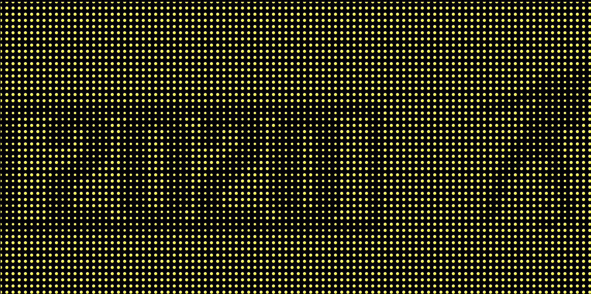

# Demo

## Algorithm
* Pick up pixels from black and white image(indeed white colors are transparent)
* Assign picked color to line color.
* As transparent colors become no stroke color, there are the defference between black color and white color.
  This lead to shallow effective to see image. 